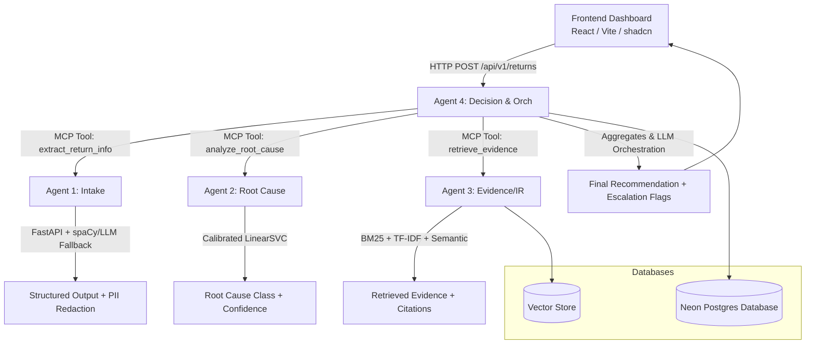

# System Architecture

## Architecture Diagram



## Pipeline (reference)
```
Customer return text
        |
        v
[Agent 1: Intake]        --(MCP tool: extract_return_info)-->
        |
        v
[Agent 2: Root Cause]    --(MCP tool: analyze_root_cause)-->
        |
        v
[Agent 3: Evidence/IR]   --(MCP tool: retrieve_evidence)-->
        |
        v
[Agent 4: Decision]      --(MCP tool: generate_final_recommendation)-->
        |
        v
   Frontend dashboard / human reviewer
```
Agents communicate using MCP (Model Context Protocol) over Streamable HTTP.
Agent 4 is both an MCP server (for the frontend) and an MCP client
(it calls Agents 1, 2, and 3 in sequence).
